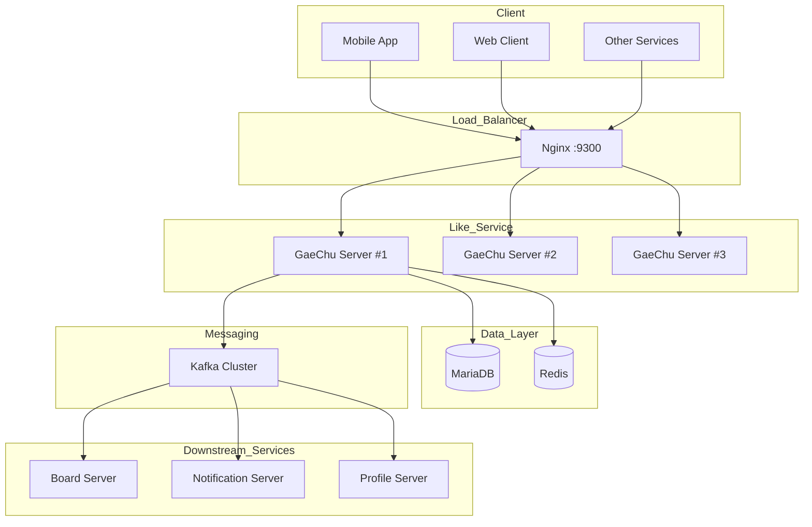
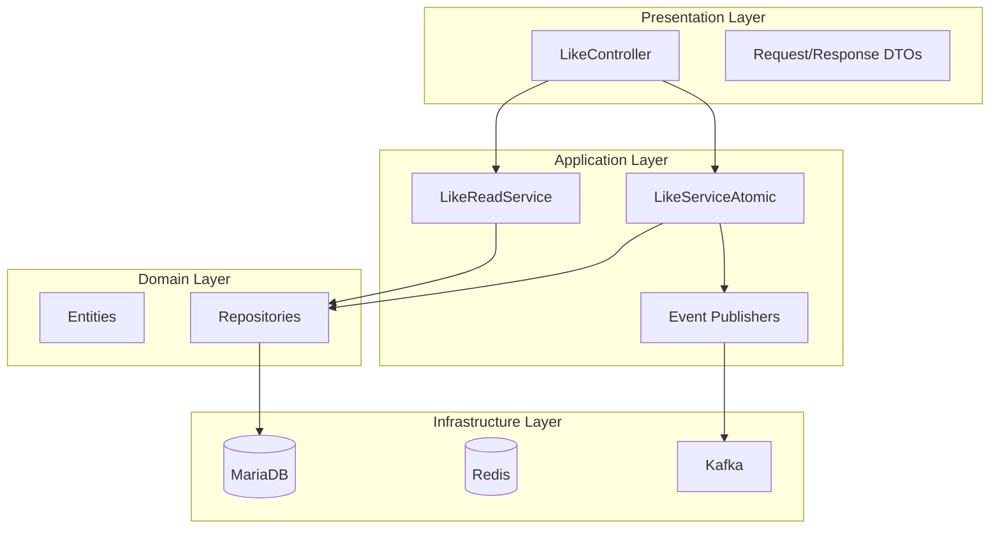
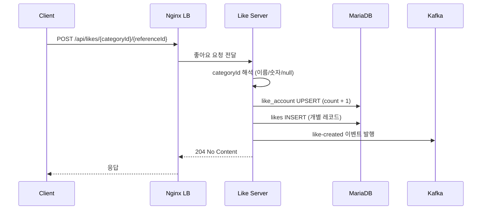
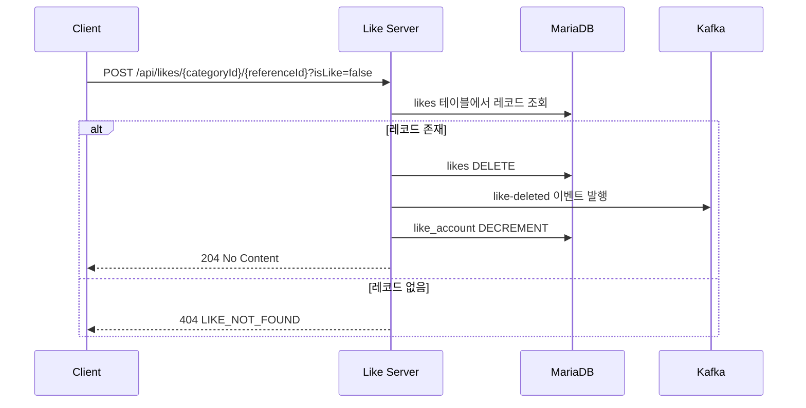
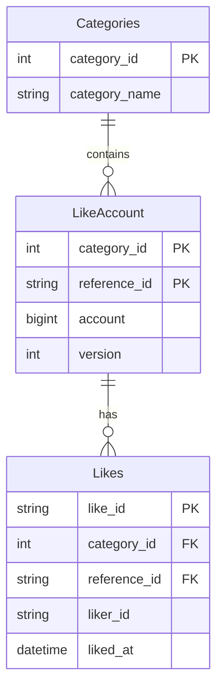

# GaeChu-Server 가이드 문서

## 1. 개요

### 1.1 목적

GaeChu-Server는 플랫폼 내 콘텐츠(게시글, 댓글, 아티클 등)에 대한 좋아요(Like) 기능을 전담하는 마이크로서비스이다.

### 1.2 주요 기능

| 기능        | 설명                         |
|-----------|----------------------------|
| 좋아요/취소    | 콘텐츠에 대한 좋아요 등록 및 취소        |
| 좋아요 수 조회  | 단건/다건 콘텐츠의 좋아요 수 조회        |
| 좋아요 상세 조회 | 콘텐츠의 좋아요 수 및 좋아요 사용자 목록 조회 |
| 사용자별 조회   | 특정 사용자가 좋아요한 콘텐츠 목록 조회     |
| 카테고리 지원   | 다양한 콘텐츠 유형별 좋아요 관리         |
| 이벤트 발행    | 좋아요 변경 시 Kafka 이벤트 발행      |

### 1.3 기술 스택

| 구분             | 기술                        |
|----------------|---------------------------|
| Framework      | Spring Boot 3.5.6         |
| Language       | Java 21 (Eclipse Temurin) |
| Database       | MariaDB 11.x              |
| Cache          | Redis 7.x                 |
| Message Broker | Apache Kafka              |
| ID 생성          | Snowflake Algorithm       |
| Build          | Gradle 8.x                |

---

## 2. 시스템 아키텍처

### 2.1 전체 구조



### 2.2 레이어 아키텍처



### 2.3 좋아요 흐름



### 2.4 좋아요 취소 흐름



---

## 3. 데이터 모델

### 3.1 ERD



### 3.2 테이블 상세

#### Categories (카테고리 마스터)

| 필드            | 타입           | 필수 | 설명           |
|---------------|--------------|----|--------------|
| category_id   | INT          | Y  | 카테고리 ID (PK) |
| category_name | VARCHAR(100) | Y  | 카테고리 명칭      |

**초기 데이터 예시:**

| ID | 명칭      |
|----|---------|
| 1  | BOARD   |
| 2  | ARTICLE |
| 3  | COMMENT |

#### LikeAccount (좋아요 집계)

| 필드           | 타입           | 필수 | 설명                       |
|--------------|--------------|----|--------------------------|
| category_id  | INT          | Y  | 카테고리 ID (PK, FK)         |
| reference_id | VARCHAR(100) | Y  | 콘텐츠 ID (PK)              |
| account      | BIGINT       | Y  | 좋아요 수 (기본값: 0)           |
| version      | INT          | Y  | Optimistic Lock (기본값: 0) |

#### Likes (좋아요 상세)

| 필드           | 타입           | 필수 | 설명                |
|--------------|--------------|----|-------------------|
| like_id      | VARCHAR(255) | Y  | Snowflake ID (PK) |
| category_id  | INT          | Y  | 카테고리 ID (FK)      |
| reference_id | VARCHAR(100) | Y  | 콘텐츠 ID (FK)       |
| liker_id     | VARCHAR(100) | Y  | 좋아요 사용자 ID        |
| liked_at     | DATETIME(6)  | Y  | 좋아요 시각            |

**Unique 제약조건:** (category_id, reference_id, liker_id)

---

## 4. API 명세

### 4.1 Base URL

```
/api/likes
```

### 4.2 categoryId 해석 규칙

| 입력 값       | 해석 방식              | 예시            |
|------------|--------------------|---------------|
| 숫자 문자열     | 해당 숫자를 카테고리 ID로 사용 | "3" → 3       |
| 카테고리 이름    | 내부 캐시에서 ID 조회      | "board" → 1   |
| "null", 공백 | null로 간주           | "null" → null |

### 4.3 좋아요/좋아요 취소

```
POST /api/likes/{categoryId}/{referenceId}
```

**Query Parameters**

| 파라미터    | 타입      | 필수 | 설명                 |
|---------|---------|----|--------------------|
| likerId | String  | Y  | 좋아요 수행 사용자 ID      |
| isLike  | Boolean | Y  | true=좋아요, false=취소 |

**Path Parameters**

| 파라미터        | 타입     | 필수 | 설명            |
|-------------|--------|----|---------------|
| categoryId  | String | Y  | 카테고리 ID 또는 이름 |
| referenceId | String | Y  | 콘텐츠 식별자       |

**Response**

```
204 No Content
```

**Error**

| 코드       | 상태  | 설명                |
|----------|-----|-------------------|
| CAT_001  | 400 | 유효하지 않은 카테고리      |
| LIKE_001 | 404 | 좋아요 레코드 없음 (취소 시) |

**예시 (cURL)**

```bash
# 좋아요
curl -X POST "http://localhost:8080/api/likes/board/12345?likerId=user-1&isLike=true"

# 좋아요 취소
curl -X POST "http://localhost:8080/api/likes/board/12345?likerId=user-1&isLike=false"

# categoryId를 숫자로 사용
curl -X POST "http://localhost:8080/api/likes/3/12345?likerId=user-1&isLike=true"
```

### 4.4 좋아요 상세 조회

```
GET /api/likes/detail/{categoryId}/{referenceId}
```

**Response**

```json
{
  "referenceId": "12345",
  "likeCount": 10,
  "likerIds": ["user-1", "user-2", "user-3"]
}
```

**예시 (cURL)**

```bash
curl "http://localhost:8080/api/likes/detail/board/12345"
```

### 4.5 좋아요 수 일괄 조회

```
GET /api/likes/count/{categoryId}
```

**Query Parameters**

| 파라미터         | 타입             | 필수 | 설명            |
|--------------|----------------|----|---------------|
| referenceIds | List\<String\> | Y  | 조회할 콘텐츠 ID 목록 |

**Response**

```json
[
  { "referenceId": "12345", "likeCount": 10 },
  { "referenceId": "67890", "likeCount": 2 }
]
```

**예시 (cURL)**

```bash
curl "http://localhost:8080/api/likes/count/board?referenceIds=12345&referenceIds=67890"
```

### 4.6 사용자별 좋아요 목록 조회

```
GET /api/likes/count/{categoryId}/{userId}
```

**Response**

```json
[
  { "referenceId": "12345", "likeCount": 10 },
  { "referenceId": "77777", "likeCount": 5 }
]
```

**예시 (cURL)**

```bash
curl "http://localhost:8080/api/likes/count/board/user-1"
```

### 4.7 헬스 체크

```
GET /health
```

**Response**

```
Server is up
```

---

## 5. 이벤트 명세

### 5.1 Kafka Topics

| Topic        | Producer      | Consumer                          | 설명         |
|--------------|---------------|-----------------------------------|------------|
| like-created | GaeChu Server | Board Server, Notification Server | 좋아요 생성 이벤트 |
| like-deleted | GaeChu Server | Board Server, Notification Server | 좋아요 삭제 이벤트 |

### 5.2 이벤트 페이로드

#### like-created / like-deleted

```json
{
  "articleId": "12345",
  "likerId": "user-1"
}
```

| 필드        | 타입     | 설명                |
|-----------|--------|-------------------|
| articleId | String | 콘텐츠(Reference) ID |
| likerId   | String | 좋아요 수행 사용자 ID     |

---

## 6. 비즈니스 규칙

### 6.1 좋아요 규칙

| 규칙    | 설명                            |
|-------|-------------------------------|
| 중복 방지 | 동일 사용자가 동일 콘텐츠에 중복 좋아요 불가     |
| 취소 조건 | 기존 좋아요 레코드가 있어야 취소 가능         |
| 원자성   | 좋아요/취소 시 집계 테이블과 상세 테이블 동시 갱신 |

### 6.2 카테고리 규칙

| 규칙      | 설명                               |
|---------|----------------------------------|
| 캐시 로딩   | 서버 시작 시 DB에서 카테고리 캐시 로딩          |
| 이름 해석   | 대소문자 구분 없이 카테고리 이름으로 ID 조회 가능    |
| null 처리 | 일부 API는 null을 0으로 치환, 일부는 그대로 전달 |

### 6.3 데이터 정합성

| 규칙         | 설명                                     |
|------------|----------------------------------------|
| 부모-자식 관계   | LikeAccount(부모)가 먼저 생성된 후 Likes(자식) 생성 |
| FK 제약      | likes 테이블은 like_account 테이블 참조         |
| CASCADE 삭제 | 콘텐츠 삭제 시 관련 좋아요 데이터 연쇄 삭제              |

---

## 7. 인덱스 설계

### 7.1 MariaDB 인덱스

#### likes 테이블

```sql
-- 콘텐츠별 좋아요 조회
CREATE INDEX idx_likes_reference ON likes (reference_id);

-- 사용자별 좋아요 이력
CREATE INDEX idx_likes_liker ON likes (liker_id);

-- 카테고리별 필터링
CREATE INDEX idx_likes_category ON likes (category_id);

-- 중복 방지 (Unique)
CREATE UNIQUE INDEX uq_likes_category_ref_liker
    ON likes (category_id, reference_id, liker_id);
```

#### like_account 테이블

```sql
-- 콘텐츠별 집계 조회
CREATE INDEX idx_like_account_reference ON like_account (reference_id);
```

---

## 8. 에러 코드

### 8.1 카테고리 에러

| 코드      | HTTP Status | 메시지            | 설명           |
|---------|-------------|----------------|--------------|
| CAT_001 | 400         | 허용하지않은 카테고리입니다 | 유효하지 않은 카테고리 |

### 8.2 좋아요 에러

| 코드       | HTTP Status | 메시지            | 설명               |
|----------|-------------|----------------|------------------|
| LIKE_001 | 404         | Like Not Found | 좋아요 레코드를 찾을 수 없음 |

### 8.3 에러 응답 형식

```
HTTP/1.1 400 Bad Request
Content-Type: text/plain

허용하지않은 카테고리입니다
```

---

## 9. 환경 설정

### 9.1 환경 변수

```bash
# Spring Profile
SPRING_PROFILES_ACTIVE=dev

# Database
DATABASE_HOST=localhost
DATABASE_PORT=4000
DATABASE_NAME=gaechus
DATABASE_USER_NAME=root
DATABASE_PASSWORD=pass123#

# Kafka
KAFKA_URL1=localhost:29091
KAFKA_URL2=localhost:29092
KAFKA_URL3=localhost:29093

# Redis
REDIS_HOST=localhost
REDIS_PORT=6379
```

### 9.2 Docker 배포

#### Dockerfile

```dockerfile
# Build stage
FROM eclipse-temurin:21-jdk AS build
WORKDIR /app
COPY gradlew gradle build.gradle settings.gradle ./
COPY src ./src
RUN chmod +x ./gradlew && ./gradlew clean bootJar -x test

# Runtime stage
FROM eclipse-temurin:21-jre
WORKDIR /app
COPY --from=build /app/build/libs/*.jar /app/app.jar
ENTRYPOINT ["java", "-jar", "/app/app.jar"]
```

### 9.3 Docker Compose

```yaml
version: '3.8'

services:
  nginx:
    image: nginx:alpine
    ports:
      - "9300:80"
    volumes:
      - ./nginx/nginx.conf:/etc/nginx/nginx.conf:ro
    depends_on:
      - gaechu-server-1
      - gaechu-server-2
      - gaechu-server-3
    networks:
      - gaechu-network

  gaechu-server-1:
    image: ddingsh9/gaechu-server:latest
    env_file: .env.prod
    healthcheck:
      test: [ "CMD", "curl", "-f", "http://localhost:8080/health" ]
      interval: 15s
      timeout: 5s
      retries: 3
    logging:
      driver: "json-file"
      options:
        max-size: "50m"
        max-file: "3"
    networks:
      - gaechu-network
      - infra-network

  gaechu-server-2:
    image: ddingsh9/gaechu-server:latest
    env_file: .env.prod
    healthcheck:
      test: [ "CMD", "curl", "-f", "http://localhost:8080/health" ]
      interval: 15s
      timeout: 5s
      retries: 3
    networks:
      - gaechu-network
      - infra-network

  gaechu-server-3:
    image: ddingsh9/gaechu-server:latest
    env_file: .env.prod
    healthcheck:
      test: [ "CMD", "curl", "-f", "http://localhost:8080/health" ]
      interval: 15s
      timeout: 5s
      retries: 3
    networks:
      - gaechu-network
      - infra-network

networks:
  gaechu-network:
    driver: bridge
  infra-network:
    external: true
```

### 9.4 Nginx 설정

```nginx
upstream gaechu_servers {
    server gaechu-server-1:8080;
    server gaechu-server-2:8080;
    server gaechu-server-3:8080;
}

server {
    listen 80;
    server_name localhost;

    location / {
        proxy_pass http://gaechu_servers;
        proxy_set_header Host $host;
        proxy_set_header X-Real-IP $remote_addr;
        proxy_set_header X-Forwarded-For $proxy_add_x_forwarded_for;
        proxy_set_header X-Forwarded-Proto $scheme;
    }

    location /health {
        proxy_pass http://gaechu_servers/health;
        access_log off;
    }
}
```

---

## 10. 핵심 컴포넌트

### 10.1 Snowflake ID 생성기

분산 환경에서 고유 ID를 생성하기 위해 Snowflake 알고리즘 사용.

```
|-- 1 bit --|-- 42 bits --|-- 10 bits --|-- 12 bits --|
|   sign    |  timestamp  |   node id   |  sequence   |
```

- **64-bit 고유 ID**: 충돌 없는 분산 ID 생성
- **시간순 정렬**: timestamp 기반으로 자연 정렬 가능
- **초당 4096개**: 동일 밀리초 내 최대 시퀀스
- **Epoch**: 2024-01-01T00:00:00Z

### 10.2 DataInitializer

서버 시작 시 카테고리 데이터를 DB에서 로딩하여 메모리 캐시에 저장.

```java

@Component
public class DataInitializer {
	private static final Map<String, Integer> categoryNameToId;
	
	@PostConstruct
	public void init() {
		// DB에서 카테고리 로딩 후 캐시 저장
	}
	
	public Optional<Integer> getCategoryIdByName(String name) {
		// O(1) 조회
	}
}
```

### 10.3 Atomic Write Pattern

좋아요 쓰기 작업의 원자성 보장:

```java

@Transactional
public int like(String referenceId, int categoryId, String likerId) {
	// 1. 부모(LikeAccount) UPSERT - 참조 무결성 보장
	likeAccountRepository.upsertIncrementAccount(categoryId, referenceId);
	
	// 2. 자식(Likes) INSERT
	likeRepository.saveAndFlush(like);
	
	// 3. Kafka 이벤트 발행
	eventPublisher.publish("like-created", event);
}
```

---

## 11. 성능 특성

### 11.1 쓰기 작업 (좋아요/취소)

| 항목    | 설명                           |
|-------|------------------------------|
| 복잡도   | O(1)                         |
| DB 연산 | UPSERT 1회 + INSERT/DELETE 1회 |
| 트랜잭션  | 단일 트랜잭션                      |
| 평균 지연 | 10-50ms                      |

### 11.2 읽기 작업

| 항목      | 설명               |
|---------|------------------|
| 복잡도     | O(n) - n개 콘텐츠 조회 |
| 카테고리 조회 | O(1) - 메모리 캐시    |
| 평균 지연   | 5-20ms           |

### 11.3 확장성

| 항목     | 설명                       |
|--------|--------------------------|
| 수평 확장  | Stateless 설계로 인스턴스 추가 가능 |
| 로드 밸런싱 | Nginx Upstream 설정        |
| 이벤트 처리 | Kafka 파티션별 순서 보장         |

---

## 12. 테스트

### 12.1 테스트 구성

```
src/test/java/
├── LikeControllerWebMvcTest.java    # Controller 단위 테스트
├── LikeReadServiceTest.java         # Service 단위 테스트
├── LikeReadIntegrationTest.java     # 통합 테스트
└── DataInitializerTest.java         # 유틸리티 테스트
```

### 12.2 테스트 실행

```bash
# 전체 테스트
./gradlew test

# 특정 테스트 클래스
./gradlew test --tests "LikeControllerWebMvcTest"
```

---

## 13. 빠른 테스트 (Postman)

### 13.1 환경 변수

```
BASE_URL = http://localhost:8080
```

### 13.2 테스트 목록

**1) 좋아요**

```
POST {{BASE_URL}}/api/likes/board/12345?likerId=user-1&isLike=true
```

**2) 좋아요 취소**

```
POST {{BASE_URL}}/api/likes/board/12345?likerId=user-1&isLike=false
```

**3) 상세 조회**

```
GET {{BASE_URL}}/api/likes/detail/board/12345
```

**4) 일괄 조회**

```
GET {{BASE_URL}}/api/likes/count/board?referenceIds=12345&referenceIds=67890
```

**5) 사용자별 조회**

```
GET {{BASE_URL}}/api/likes/count/board/user-1
```

---

## 14. 향후 계획

### Phase 1 - 핵심 기능 (완료)

- [x] 좋아요/취소 API
- [x] 좋아요 수 조회 API
- [x] 좋아요 상세 조회 API
- [x] Kafka 이벤트 발행
- [x] Snowflake ID 생성
- [x] 카테고리 캐시

### Phase 2 - 고도화 (진행 중)

- [ ] ReferenceDeletedEventConsumer 구현
- [ ] Redis 캐싱 활성화
- [ ] API 인증/인가 연동
- [ ] 모니터링 (Prometheus + Grafana)

### Phase 3 - 확장

- [ ] 좋아요 알림 연동
- [ ] 좋아요 통계 집계
- [ ] Rate Limiting
- [ ] Circuit Breaker 패턴

---

**버전**: 0.0.1-SNAPSHOT
**최종 업데이트**: 2025-01-20
**팀**: TeamBiund Development Team
